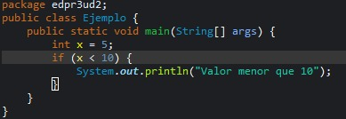
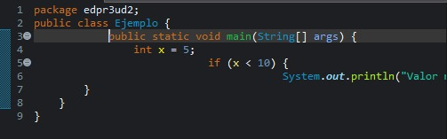
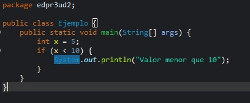
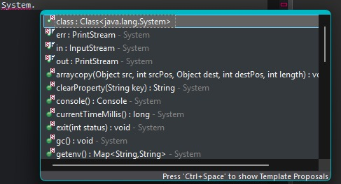
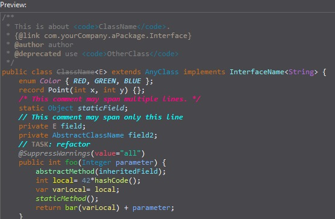
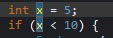
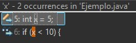
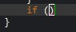
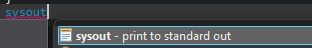

# PROG-U2-PracticaEclipseEditor
## 1 Opciones generales
Esta opción de eclipse nos remarca las llaves de un determinado bloque al hacer referencia a la apertura o cierre de este, por ejemplo al situar el ratón sobre la llave de apertura de un if nos mostrará la llave que cierra ese bloque y vicebersa, esto es útil por ejemplo cuando tenemos una gran cantidad de ifs anidados, bloques dentro de bloques, etc... ya que nos ayuda a llevar de mejor manera la estructura del código.

## 2 Save Actions
La opción Format source code nos permite ordenar el código de manera completa al guardar el archivo y el organize imports nos ordena los imports realizados y elimina los que no se estén usando.

Código desordenado

Código ordenado

## 3 Content Assist
Este parámetro lo que hace es ajustar el retardo a la hora de usar el autocompletado, si está en 0, las sugerencias apareceran de manera automática y sin retardo, mejora la productividad porque permite que el autocompletado sea más rápido y ágil.

## 4 Syntax Coloring
Es importante tener un buen contraste visual ya que permite una legibilidad más sencilla a la vez que resulta más sencillo la distinción entre los diferentes elementos del código.

## 5 Mark Occurrences
La diferencia entre Mark Occurrences y Search References es que el primero resalta todos los elementos que se llamen igual que el elemento señalado en el código mientras que el segundo busca en el código todas las referencias a ese elemento.

Captura Mark Occurrences

Captura Search References

## 6 Typing
Ayudan a reducir los errores ya que evitan despistes de los programadores a la hora del cierre de bloques de código, comillas o paréntesis.

## 7 Templates

